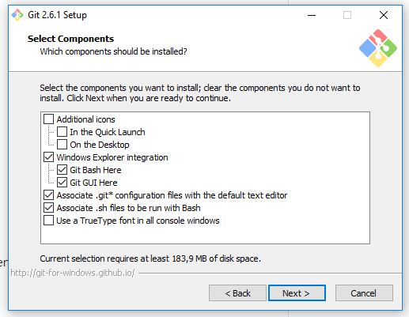

# Instalasi GIT

Langkah-langkah instalasi :

* Download master git dari [WEB ini](https://git-scm.com/downloads "Download git"). Sesuaikan dengan versi OS yang digunakan.

* Double klik file master git, untuk melakukan proses instalasi. Klik **next**.

	

* Langkah selanjutnya berisi informasi lisensi tentang git. Klik **next**.

	

* Memilih lokasi Git akan di instal. Klik **next** untuk melanjutkan.

	

* Memilih komponen Git yang akan di instal. Pada langkah ini, ikuti default cheklist yang ada. Klik **next**.

	

* Pengaturan shortcut menu Start dengan default pada folder "Git". Klik **next**.

	

* Bagaimana Git akan digunakan dari command line. Pilih "Use Git from the windows Command Prompt". Klik **next**.

	

* Pilih "Checkout Windows-Style, commit Unix-style line endings". Kemudian klik **next**.

	

* Pilih "Use MinTTY" sebagai terminal emulator Git Bash. Klik **next**.

	

* Beri centang pada "Enable file system caching". Klik **next**.

	

* Instalasi Git sedang berjalan. Tunggu proses hingga selesai.  

	

* Proses Git telas selesai. Klik tombol **Finish**

	

* Cek instalasi Git yang dilakukan dari menu Start dengan mengetikkan "git". Terdapat 2 buah Git ( Bash dan Gui )

	

* Git Bash

	

* Git Gui

	

* Mengecek versi git dari Command Promt dengan perintah "git --version". Dan diketahui versi Git yang terinstal adalah versi 2.6.1.windows.1

	

* Selesai
