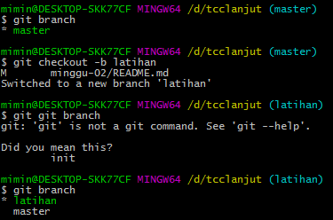
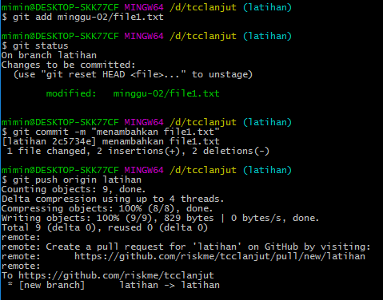
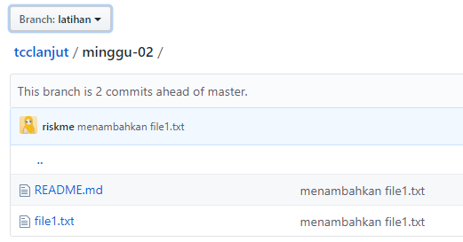
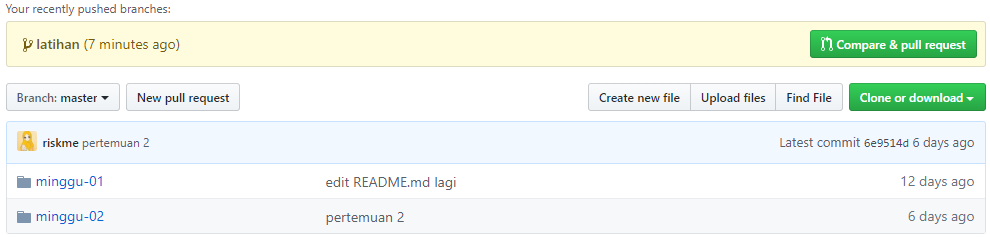
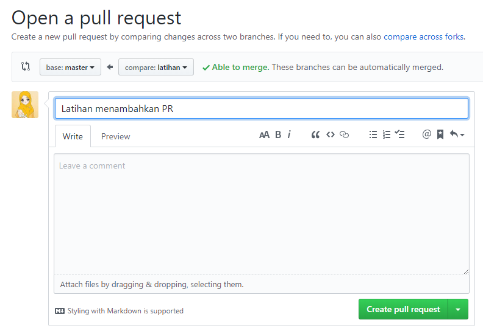
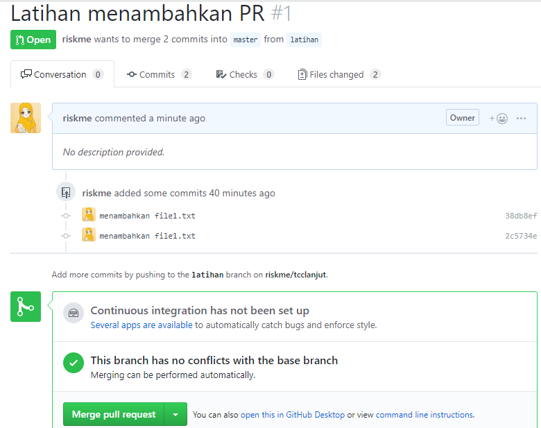
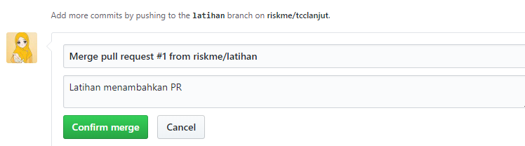
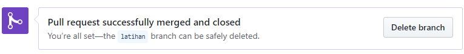

# Membuat dan Mengintegrasikan Pull Request

1. **Membuat branch dengan nama latihan**
Percabangan atau **branching** digunakan untuk mengembangkan fitur-fitur secara terisolasi. Cabang utama atau **master** merupakan cabang bawaan ketika membuat repositori. Cabang lain (branch) digunakan untuk pengembangan, setelah selesai, dapat digabungkan kembali ke cabang utama (master).

- #**git branch** : digunakan untuk melihat cabang apa saja yang ada di repositori. 
Tanda bintang (*) artinya cabang dimana kita berada.
- #**git checkout -b latihan** : digunakan untuk membuat cabang baru dengan nama "coba" dan beralih kedalamnya. 
2. **Menambahkan file baru pada repo dan menambahkannya pada branch "latihan"**
File yang ditambahkan bernama "file1.txt".

- #git push origin latihan : digunakan untuk menambahkan file1.txt tersebut kedalam cabang "latihan".

3. **Melakukan compare & pull request**
compare & pull requst digunakan untuk membandingkan cabang master dan latihan. Ini dilakukan dengan mengklik tombol Compare & Pull Request.

4. **Melakukan Merger/penggabungan dari masing-masing branch**

Dilakukan dengan mengklik tombol *confirm merge*.

Pull request untuk menambahkan file berhasil dilakukan.

