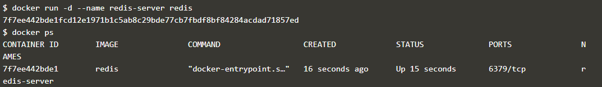

# Komunikasi Antar Container pada Docker

## Komunikasi menggunakan Link

Container dapat saling berkomunikasi antar satu dan yang lainnya dengan fasilitas link. Dengan docker, kunci ketika menggunakan link untuk menghubungkan antar container adalah penamaan dari container itu sendiri.
	
Ketika menghubungkan container dengan link, sangat penting untuk memberikan nama yang mudah diingat bagi container sumber yang akan dihubungkan.

1. **Menjalankan Redis**

  **docker run -d --name redis-server redis**

  

  Container redis dijalankan dengan nama redis-server yang akan dijadikan container sumber data store.

2. **Membuat link**

  Untuk menjalankan container baru yang ingin dihubungkan kepada container sumber data store, digunakan opsi :

   	**--link <nama|id container>:<alias>**

  Nama container mendefinisikan sumber container yang telah dibuat pada langkah sebelumnya, sedangkan alias mendefinisikan nama dari host-nya.
  
  -  **docker run --link redis-server:redis alpine env**
  
   Image alpine akan dilink kan ke container redis-server dengan nama alias redis. Docker akan men-set beberapa environment variable berdasarkan link ke sebuah container. Environment variable ini akan memberikan informasi seperti port dan alamat IP.

  - **docker run --link redis-server:redis alpine cat /etc/hosts**

    Docker akan meng-update file HOSTS ubuntu container dengan menambahkan sebuah input untuk sumber container berupa *nama asli container, alias, dan hash id* .

  

    Dari gambar diatas, sudah dipastikan bahwa antar kedua container (alpine dan redis-server) sudah terhubung dengan menggunakan fasilitas link.

  - **docker run --link redis-server:redis alpine ping -c 1 redis**

  

  ​	Perintah ping antar container digunakan untuk mengetahui suatu host terhubung dalam satu jaringan atau tidak. 

3. **Mengkoneksikan ke App**

  **docker run -d -p 3000:3000 --link redis-server:redis katacoda/redis-node-docker-example**

  Perintah ini digunkanan untuk menjalankan menjalankan container katacoda/redis-node-docker-example yang di link bersama container redis, dengan meng-ekspose port yang digunakan yaitu port 3000:3000.

  

  **curl docker:3000**

  

4. **Mengkoneksikan ke Redis CLI**

  **docker run -it --link redis-server:redis redis redis-cli -h redis**

  

## Komunikasi menggunakan Network

Untuk menghubungkan beberapa container menggunakan network, maka harus membuat sebuah “network” terlebih dahulu dengan docker CLI, yang kemudian digunakan untuk meletakkan container-container pada network tersebut sehingga dapat saling berkomunikasi antar satu dengan lainnya.

Dalam docker network ini,docker tidak lagi menambahkan environment variable dan meng-update file /etc/hosts pada container. Setiap node dapat digabung ataupun dipisah seperti pada jaringan tradisional pada umumnya.

1. ##### **Membuat network dengan nama backend-network**

   **docker network create backend-network**

   

   

   Untuk menghubungkan sebuah container kedalam network yang dibuat, maka harus memasukan opsi  ***--net=network_name***.

   Perintah **docker run -d --name=redis --net=backend-network redis**, digunakan untuk menghubungkan redis dengan network backend-network.

2. ##### **Komunikasi Network**

   **docker run --net=backend-network alpine env**

   

   **docker run --net=backend-network alpine cat /etc/hosts**

   

   **docker run --net=backend-network alpine cat /etc/resolv.conf**

   

   > ​	Container alpine terhubung dengan backend-network menggunakan alamat IP DNS Server dengan alamat 127.0.0.11

   **docker run --net=backend-network alpine ping -c1 redis**

   

   

   Dari perintah-perintah tersebut, terbukti bahwa menggunakan docker network tidak melakukan update terhadap environment variable maupun file hosts pada container. Sebagai gantinya, docker menggunakan *embedded*  *DNS Server* sebagai alat komunikasi yang digunakan oleh para container yang tergabung dalam network tersebut. Alamat IP DNS Server ini ditambahkan kepada semua container melalui file/etc/resolv.conf.

   DNS Server ini bekerja, apabila ada suatu container yang mengakses container lainnya melalui nama yang dikenal, misalnya redis1 container, DNS Server akan me-resolve nama domain container tersebut ke dalam alamat IP, sehingga container tersebut dapat dihubungi

3. ##### **Mengkoneksikan 2 container**

   **docker network create frontend-network**

   **docker network connect frontend-network redis**

   

   

   

   **docker run -d -p 3000:3000 --net=frontend-network katacoda/redis-node-docker-example**

   

   **curl docker:3000**

   

