# Kubectl

Menggunakan Kubectl untuk membuat dan menjalankan Deployment, Kontrol Replikasi, dan mengeksposnya melalui Service tanpa menulis definisi yaml. Sehingga container dapat dijalankan dengan cepat ke dalam kluster.

1. Memulai Cluster

	- minikube start : perintah untuk memulai minikube.

	- kubectl get nodes : digunakan untuk mengechek apakah node telah siap

	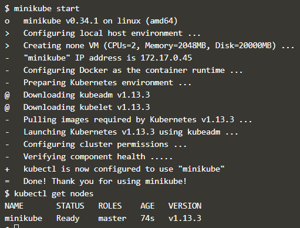

2. Menjalankan Kubectl

	Untuk menjalankan Kubectl, digunakan perintah RUN. Syntak perintahnya adalah 
	**kubectl run <name of deployment> <properties>**

	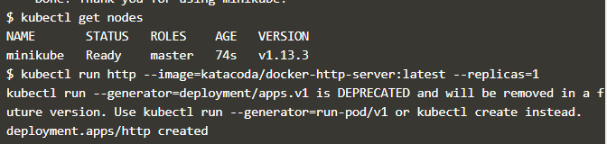

	Untuk melihat status deploymentnya digunakan perintah : **kubectl get deployments**

	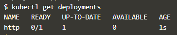

	Dan untuk melihat apa saja yang telah dibuat oleh Kubernetes, proses deployment ini dapat dideskripsikan dengan perintah **kubectl describe deployment http**

	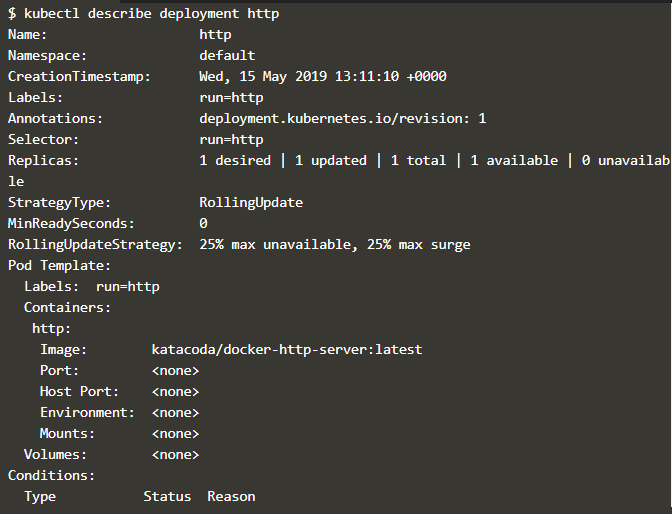

	Dalam deskripsi tersebut menunjukkan berapa banyak replika yang tersedia, label dan event yang terkait.

3. Kubectl Expose

	Perintah kubectl expose digunakan untuk menentukan berbagai parameter layanan dan cara mengekspos penyebaran.

	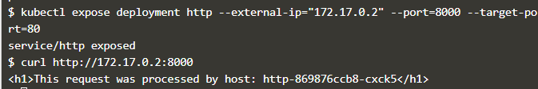

	- perintah ditas digunakan untuk mengekspos port kontainer 80 pada host 8000 yang mengikat ip eksternal host.

	- Perintah curl digunakan untuk melihat hasil dari service HTTP.

4. Kubectl Run dan Expose

	Dalam perintah kubectl run, bisa digunakan untuk membuat deployment dan mengeksposenya dengan satu perintah saja.

	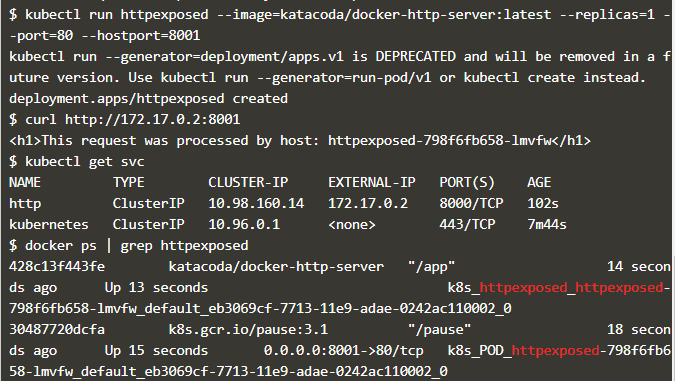

	- Perintah pertama dimaksudkan untuk membuat service kedua dan mengeksposenya pada port 8001.

	- Perintah *kubectl get svc* digunakan untuk melihat service yang terdaftar.

	- Perintah *docker ps | grep httpexposed* digunakan untuk melihat detail dari service. 

5. Skala Container

	Pengukuran jumlah replika dari deploymen ini akan meminta Kubernetes untuk meluncurkan Pod tambahan. Pod ini kemudian akan secara otomatis dimuat seimbang menggunakan service yang terbuka.

	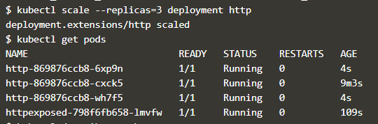

	- Perintah *kubectl scale* digunakan untuk menyesuaikan jumlah Pods yang berjalan pada deployment atau replikasi tertentu.

	- Perintah *kubectl get pods* digunakan untuk melihat list dari semua pod yang berjalan.

	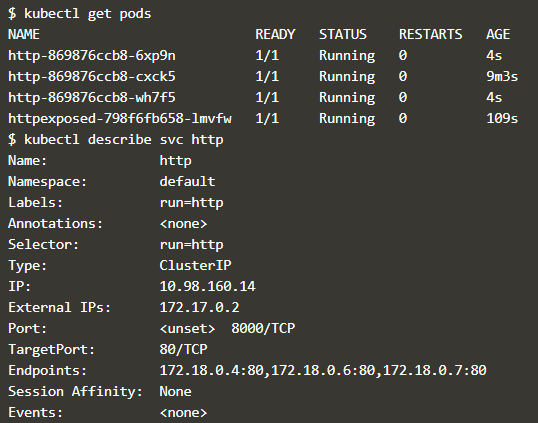

	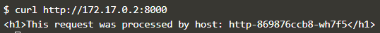

	- Perintah *kubectl describe svc http* digunakan untuk mendeskripsikan service dan melihat titik akhir dan pod-pod terkait lainnya.

# Membangun Container menggunakan YAML

Objek Deployment mendefinisikan spesifikasi container yang diperlukan, bersama dengan nama dan label yang digunakan oleh bagian lain dari Kubernetes untuk menemukan dan menghubungkannya ke aplikasi.

1. Membuat Deployment

   - Menambahkan definisi object deployment pada file deployment.yaml
     Apllikasi yang dijalankan bernana webapp1 menggunakan docker image katacoda/docker-http-server yang berjalan pada port 80.
   
    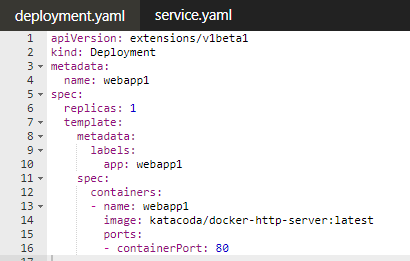

    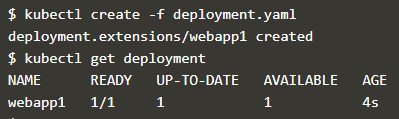

   - kubectl create -f deployment.yaml : digunakan untuk mendeploy file deployment.yaml ke dalam cluster

   - kubectl get deployment : digunakan untuk menunjukkan list semua deployment object

   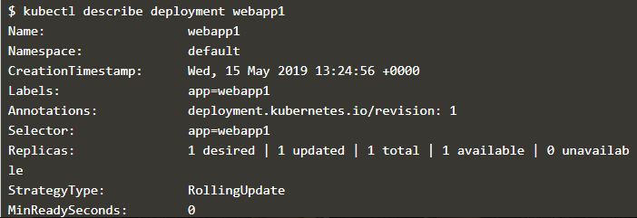

   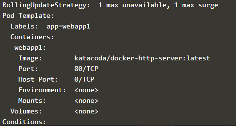

   - kubectl describe deployment webapp1 : digunakan untuk menunjukkan detail dari deployment

2. Membuat Service

	Kubernetes memiliki kemampuan jaringan yang kuat yang mengontrol bagaimana cara aplikasi berkomunikasi. Konfigurasi jaringan ini juga dapat dikontrol melalui YAML.

	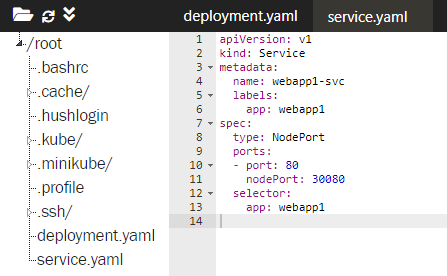

	- Service membuat aplikasi tersedia melalui NodePort.

	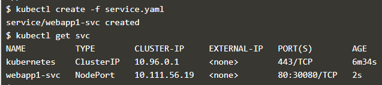

	- perintah tersebut digunakan untuk mendeploy file service.yaml

	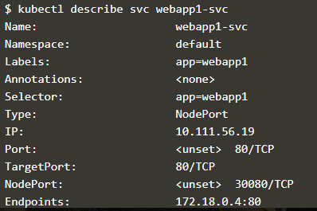

	- perintah ini digunakan untuk melihat deskripsi objek, sehingga didapatkan informasi lebih detail tentang konfigurasinya.

	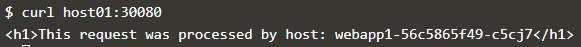

3. Mengukur Deployment

   Rincian dari YAML dapat diubah karena konfigurasi yang berbeda diperlukan dalam deployment.
   
   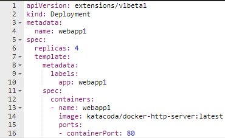

   Pada file deployment.yaml nilai replicas diganti menjadi 4 untuk meningkatkan jumlah instance yang berjalan.

   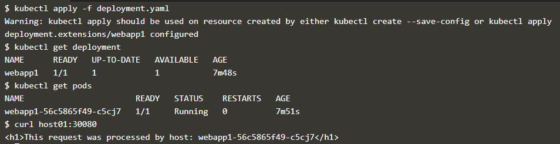

   - Perintah *kubectl apply* digunakan untuk menerapkan pembaruan definisi yang dilakukan.

   - Perintah *kubectl get deployment* digunakan untuk melihat status dari kluster yang telah diubah.

   
